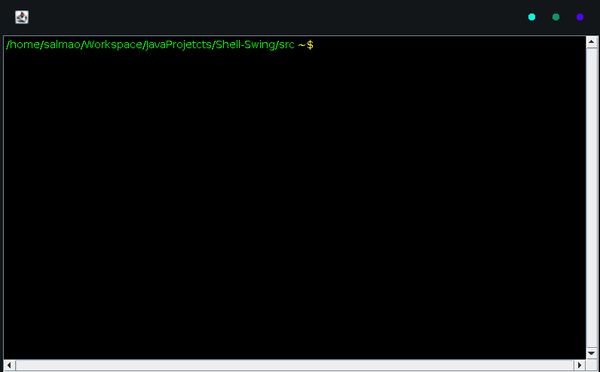

# Terminal Interpretador de Comandos Linux
Um terminal implementado com Java e Swing capaz de executar alguns comandos linux básicos



Comandos interpretados

```
cd
cp
mv
cat
mkdir
rm
ls
pwd
touch
clear
exit
```
